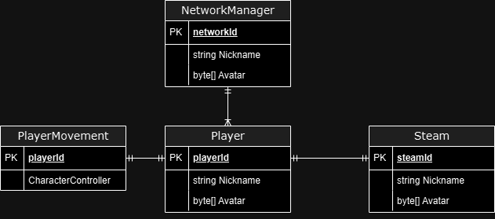
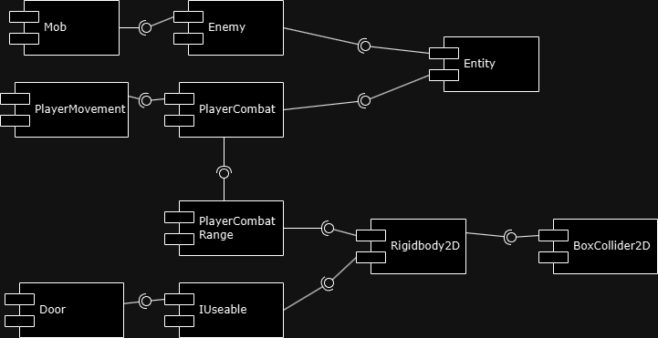
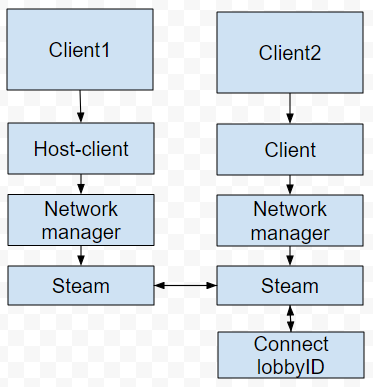
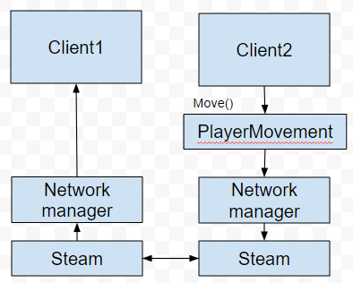
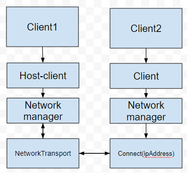

# Lyra

Story based 2d multiplayer platformer for 2 players.

All systems is reviewed in my video:

[Youtube link](https://www.youtube.com/watch?v=oj7Uv_QP9XQ)

# Expected functionality

We expect to made multiplayer using mirror and steam frameworks. Also planning to add features like steam remote play and ip connecting.

# Lab3

# Lab7,8

Using Unity Profiler, I have analyzed the performance of my scripts and how much they use my CPU. When using the ability of the Lyra character, we can see by these graphs that the CPU is affected more than usual.

Here is comperesion between PlayerMovement script CPU usage, and LyraCursor CPU usage

With the help of the provided information, I created a Unity Asset Package. This package will contain all the scripts and resources that Lyra Ability needs to function.

# Story

Kayden, with his extraordinary strength and agility, has always felt like a misfit, not because he was running from something but because he has no memory of his origins. He doesn’t know where his powers come from or why he possesses them, but he has learned to control his abilities over time. Despite his incredible physical prowess, Kayden is driven by a deep, unsettling void—he longs to understand his past, to find out who or what gave him his abilities. His journey with Lyra is just as much about uncovering his own identity as it is about survival.

Lyra, on the other hand, is a mystery wrapped in a quiet, intense presence. Her powers—defying the laws of physics, bending reality—seem otherworldly, and she’s as curious about them as Kayden is about his own. She doesn’t remember how she got them, and though she maintains a calm facade, the unknown frightens her. Her telekinetic abilities allow her to manipulate objects, deflect attacks, and shape the environment around her, but they come at a price. Each use strains her, and the source of her power remains a haunting enigma.

Their paths collide when they both wake up in an underground complex, each unsure of how they arrived. A strange security breach happened, that opened all cells and doors in facility. The facility is a labyrinth of advanced technology and deadly traps designed to test the limits of human capability.                    

Together, they must navigate through treacherous obstacles and different strange biological forms that was made using expirements in this facility, relying on each other's unique strengths to survive and escape. As they journey deeper, their bond is tested in unexpected ways, revealing emotional complexities beneath their mission. The game blends puzzle-solving, action, and teamwork as players explore a world filled with hidden secrets and challenges.

## License

Copyright (c) 2025 Andrew Shchigol, Oleksandr Nahrebelnyi  
All rights reserved.

This repository is for viewing and educational purposes only.  
You are not allowed to copy, modify, distribute, or use the code
in your own projects without explicit permission from the authors.
